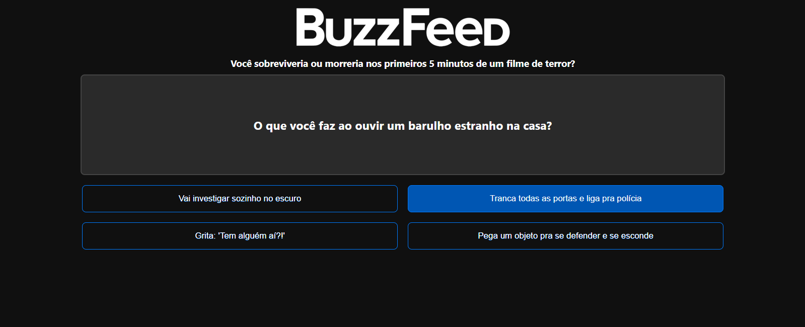
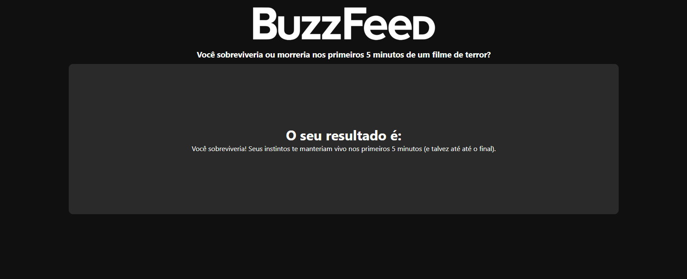

## Quiz do BuzzFeed
Projeto de quiz interativo feito com Angular, inspirado nos famosos quizzes do BuzzFeed.
A lógica foi baseada na ideia do [Felipe](https://github.com/felipeAguiarCode/angular-buzzfeed-quizz-clone), e o conteúdo do quiz pode ser totalmente customizado editando o arquivo [quizz_questions.json](https://github.com/wastecoder/angular-buzzfeed-quiz/blob/main/src/assets/data/quizz_questions.json). <br>
O tema atual é: "__Você sobreviveria ou morreria nos primeiros 5 minutos de um filme de terror?__", onde o usuário responde a uma série de perguntas e, ao final, recebe um resultado baseado em suas escolhas.


## Instalação
1. Clone o projeto na pasta desejada:
```bash
git clone https://github.com/wastecoder/angular-buzzfeed-quiz.git
```
2. Baixe as dependências do projeto
```bash
npm install
```
  - O comando acima criará a pasta "node_modules"
3. Execute o projeto localmente
```bash
ng s -o
```
  - Isso irá iniciar e abrir o projeto no navegador.


## Imagens do Projeto

### Pergunta


### Resultado

